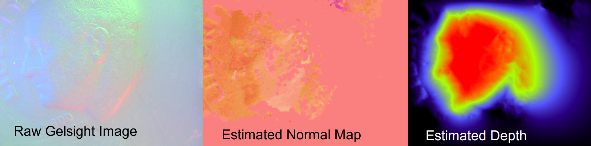

# MIT RLG GelSight Driver #

--------------------

This repository includes both calibration and driver code for using
a GelSight touch sensor.

## Installation and Dependencies ##

This repository has been tested on 
[Ubuntu 14.04](https://travis-ci.org/gizatt/gelsight_driver). It probably
works on other versions of Linux, at least, but they are not actively
supported yet. (One thing at a time.)

For quick setup on Ubuntu, use:


```
sudo apt-get install git cmake pkg-config libopencv-dev python-opencv xawtv libyaml-cpp-dev libboost-all-dev
```

`pkg-config` is necessary for the build, `opencv` is used for grabbing
images from webcams and some image processing, `xawtv` is used to
adjust exposure settings on the GelSight webcam, 'yaml' is used for
configuration and calibration files.

The python files also need dependencies:

```pip install numpy scipy```

and maybe some more that I'm forgetting (please update this README if you find them!).

To build, follow the standard CMake workflow:
```
mkdir -p build
cd build
cmake ..
make
make install
```

Installed binaries are placed in `build/install/bin`.

This repository includes two versions of (WIP!) drivers for the Gelsight
sensor. A C++ version capable of reading the webcam (but not doing reconstruction)
is in `src/gelsight_depth_driver.*`. It will eventually be fleshed out, but
a Python prototype of the calibration and driver functionality is instead
available in files `src/do_*.py`.

## Running a GelSight Sensor ##

The data flow with a GelSight sensor is:
1) The webcam inside of the camera takes an RGB image.
2) The driver maps from RGB to normal vector at each pixel using a calibration
profile.
3) The driver outputs a depth map for external consumption (which, for now,
can be done via a render window to observe the pretty pictures, or over
[LCM](https://lcm-proj.github.io/)).

## Running the Depth Driver ##

Assuming you have a calibration file available (one is provided in 
`src/filtered_2017-08-22T19:03:38.648270.calib`, performed on the
blue-and-electrical-tape Gelsight unit in 32-380), you can run the
Python depth driver with:

```python do_normal_and_depth_reconstruction.py <path_to_calibration_file>```

This application will show three images side-by-side:



You can try running `build/install/bin/run_gelsight_depth_driver --help` to see its
command-line options, and use it to get raw webcam images to sanity-check
that your Gelsight images look OK.

## Generating Calibration Data ##

To generate your own calibration via the Python scripts, you'll need two
things:
  - A rod with a square cross section of known side-length, in order to
    calibration the lateral scaling of the sensor (pixels-to-lateral-mms
    scaling). I use 1/4" square stock, and the parameters in the
    `do_rod_calibration.py` script assume this size.
  - A bearing ball of known size. `do_ball_calibration.py` assumes
    a 1/4" ball. This is for calibrating the RGB-to-normal-map step.

The procedure is (and this is still WIP/hacky!):
1. Use `build/install/bin/run_gelsight_depth_driver -s rod` to collect
images of you touching the 1/4" rod to the surface of the Gelsight.
2. Run `python do_rod_calibration <path to clear rod image> <path to background image> `
and then click on the four corners of the rod. The script should spit out
a `rod_calib_*.calib" file and report a reasonable pixel-to-mm scaling (something
like 30mm per pixel).
3. Use `build/install/bin/run_gelsight_depth_driver -s rod` to collect
images of you rolling the ball bearing on the Gelsight. Collect images of
the ball in a few different locations, and a few different pressures (sizes).
4. Use `python do_ball_calibration <path to a clear ball image> <path to a ball bg image> <path to rod calib file>`
on each clear ball image that you like (I recommend at least 5 or 6). Click on a few points around the
edge of the circle until a circle fit appears, then hit any key to exit. It should spit out a
`ball_*.calib` file.
5. Run `python do_process_calibrations.py <first ball calib> <second ball calib> ... <last ball calib>`,
which should spit out a `filtered_*.calib` file. This is your calibration for the Gelsight! (It's a YAML
file containing the mm_to_pixel scaling, as well as a grid of RGB-to-normal calibration points that the
driver uses to perform the reconstruction.